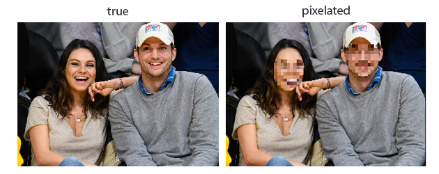
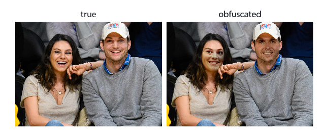
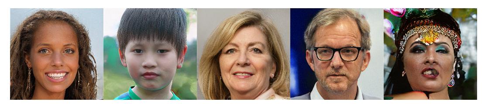

# neural-obfuscator

A library for anonymizing the identities in an image by swapping faces to the ones that have never existed before.

# Installation

### Installing from source

To install `neural-obfuscator` from the GitHub source, download the project:

```sh
git clone https://github.com/tanelp/neural-obfuscator.git
```

Then, move to the folder and run the install command:

```sh
cd neural-obfuscator
#pip install --editable .
python setup.py install
```

# Usage

## Pixelating the face



```python
import cv2
import neural_obfuscator as no

model = no.Obfuscator(method="pixelate")
img = cv2.imread("path/to/image.jpg")
img_gdpr = model.obfuscate(img)
no.show_image(img_gdpr)
```

## Swapping to a random face



```python
import cv2
import neural_obfuscator as no

model = no.Obfuscator(method="swap")
img = cv2.imread("path/to/image.jpg")
img_gdpr = model.obfuscate(img)
no.show_image(img_gdpr)
```

## Synthesysing a face with a StyleGAN model

The repository includes a PyTorch implementation of StyleGAN.



```python
import neural_obfuscator as no

model = no.StyleGAN(weights="ffhq")
latents = np.random.RandomState(5).randn(1, 512).astype(np.float32)
latents = torch.from_numpy(latents)
imgs = model.forward(latents)

no.show_image(imgs[0])
```
