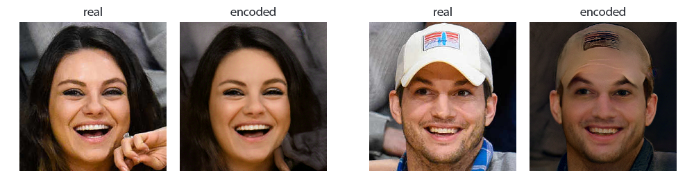

# neural-obfuscator

A library for anonymizing identities in an image by swapping faces to the ones that have never existed before.

# Installation

### Installing from source

To install `neural-obfuscator` from the GitHub source, download the project:

```sh
git clone https://github.com/tanelp/neural-obfuscator.git
```

Then, move to the folder and run the install command:

```sh
cd neural-obfuscator
pip install --editable .
```

# Usage

## Pixelating a face


```python
import cv2
import neural_obfuscator as no

model = no.Obfuscator(method="pixelate")
img = cv2.imread("path/to/image.jpg")
img_gdpr = model.obfuscate(img)
no.show_image(img_gdpr)
```

## Swapping to a random face


```python
import cv2
import neural_obfuscator as no

model = no.Obfuscator(method="swap")
img = cv2.imread("path/to/image.jpg")
img_gdpr = model.obfuscate(img)
no.show_image(img_gdpr)
```

[](https://colab.research.google.com/drive/18xGyjKZGitcAk0seR-d1J1SHQTOQ2QFf)

## Synthesysing a face with a StyleGAN model

The repository includes a PyTorch implementation of StyleGAN.


```python
import neural_obfuscator as no

model = no.StyleGAN(weights="ffhq")
latents = np.random.RandomState(5).randn(1, 512).astype(np.float32)
latents = torch.from_numpy(latents)
imgs = model.forward(latents)

no.show_image(imgs[0])
```

## Encoding a face into StyleGAN's latent space



```python
landmarks = landmarks_model.predict(img, face)
img_aligned, _ = aligner.align(img, landmarks, method="eyes_nose")
dlatents = encoder.encode(img_aligned, optim_image_size=256, num_steps=300)
```

Check `examples/encode.py` for a full example.
